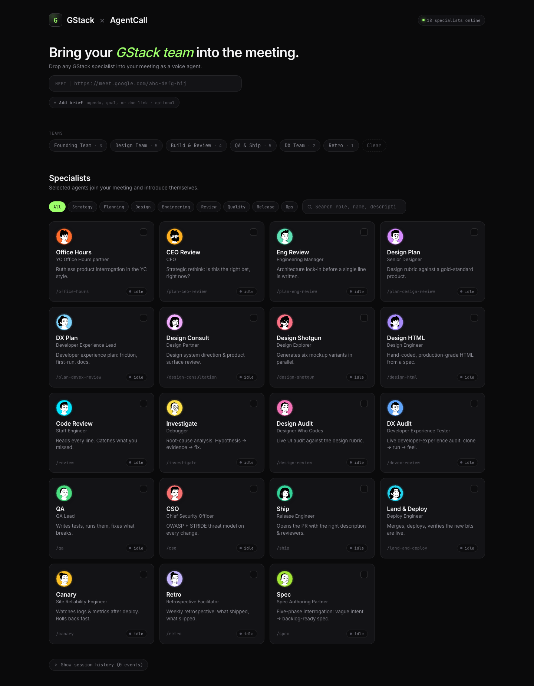

# GStack × AgentCall

Your engineering team, on the call. Every gstack specialist — CEO, CSO, QA, Eng Manager, Staff Engineer, SRE, Spec Partner, and 12 others — joins your Google Meet as a real voice bot with its own 3D avatar.

Built on top of [garrytan/gstack](https://github.com/garrytan/gstack) (the slash-command persona library) and [AgentCall](https://agentcall.dev) (the meeting-bot platform). Stdlib-only Python on the server, vanilla JS on the client, no framework, no build step.



<sub>Dashboard at `localhost:8765` — paste a Meet URL, click cards or a team preset, hit Dispatch. Each card spins up a real participant with the avatar shown.</sub>

---

## Why this exists

gstack ships 18 specialist personas you invoke with slash commands inside Claude Code. They are excellent — and stuck in a text terminal. Real product work happens in meetings: pair programming, standups, design reviews, office hours. The gap between "I have an opinionated CEO-review prompt" and "the CEO is in the call right now" is enormous.

This repo closes it. You paste a Meet link, click the cards for the specialists you want, and they dial in. Each one introduces itself, listens, and speaks back in a distinct voice. The Eng Manager has a UK accent. The CSO is dry. The CEO is fast. They all show up with their own avatar so you can tell who is talking at a glance.

It is a prototype. It works. It is also the smallest possible thing you can put in front of a founder to make them say "wait, do that again."

---

## What it looks like

- **Dashboard at `localhost:8765`** — a single page of 19 specialist cards plus six team presets (Founding Team, Design Team, Build & Review, etc.). Paste a Meet URL, click cards, hit **Dispatch selected**. Optional brief textarea (500-char cap) gets read into every bot's intro.
- **In the meeting** — each dispatched specialist appears as a separate participant with a 3D-character avatar (DiceBear `lorelei` style, deterministic per id, accent-color background pulled from the dashboard card). They say hi, name their role, mention the brief if you set one, and stay live until you recall them.
- **Voice loop** — the LISTENER specialist (the first one dispatched) forwards every transcript line to a shared intelligence-bus inbox; outbound replies dropped into the bus's outbox file get spoken back through that specialist's bridge. Cross-bot speech is gated by a single shared lock so two bots never talk over each other.
- **Recall** — one button in the dashboard footer (or `POST /recall {"all": true}`) tears every bot down. SIGTERM goes out, `{"command":"leave"}` is appended to each bridge's command file, the runners exit cleanly within a couple of seconds.

---

## Setup

### Prerequisites

- **Python 3.10+** — stdlib only for `server.py` and `specialist_runner.py`. The vendored `bridge.py` / `bridge-visual.py` need `aiohttp` and `websockets`, but those are installed by the AgentCall skill itself.
- **AgentCall API key** — sign up at [agentcall.dev](https://agentcall.dev), then `export AGENTCALL_API_KEY="ak_ac_..."`.
- **AgentCall `join-meeting` skill** installed at one of:
  - `~/.claude/skills/join-meeting/`
  - `~/.claude/skills/agentcall/`
  - `~/.claude/plugins/marketplaces/agentcall/`
  - `~/.claude/plugins/cache/agentcall/join-meeting/1.0.0/`

  The launch scripts probe these paths in order. If you have the AgentCall skill or plugin installed, you are done. Otherwise vendored copies of `bridge.py` and `bridge-visual.py` live in `vendor/` and are used as a fallback.
- **Bun or Node** — *not required.* The dashboard is plain HTML served by Python's `http.server`. Listed only because the upstream gstack project uses Bun and you may already have it.

### Install

One line — clones the repo to `~/gstack-joins-meeting` and registers it as a Claude Code skill:

```bash
curl -fsSL https://raw.githubusercontent.com/pattern-ai-labs/gstack-joins-meeting/main/install | bash
```

Then set your AgentCall key:

```bash
export AGENTCALL_API_KEY="ak_ac_..."
```

That's it. There's nothing to build, no `requirements.txt`, no `package.json`. The server is one file, the dashboard is one file, the runner is one file. If the vendored bridges need their deps: `pip install aiohttp websockets`.

---

## Run

```bash
python3 server.py
```

Then in a browser:

1. Open <http://localhost:8765>.
2. Paste a Google Meet / Zoom / Teams URL into the field at the top.
3. (Optional) Click **+ Add brief** and paste an agenda or doc link — every dispatched specialist references it in their intro.
4. Click specialist cards, or click a team preset (Founding Team, QA & Ship, etc.).
5. Hit **Dispatch selected**. Each card spins up a subprocess that joins the meeting within 5–15 seconds.
6. Watch logs at `/tmp/gstack-specialists/` and per-session events under `sessions/session-<ts>/`.

To remove bots, click **Recall all bots** in the page footer, or:

```bash
# recall a subset
curl -s -X POST http://127.0.0.1:8765/recall \
  -H 'content-type: application/json' \
  -d '{"specialists": ["plan-ceo-review", "cso"]}'

# nuke everything
curl -s -X POST http://127.0.0.1:8765/recall \
  -H 'content-type: application/json' \
  -d '{"all": true}'

# emergency tear-down for a stuck session (SIGTERM → SIGKILL via session.pid)
bash scripts/kill-session.sh sessions/session-<ts>/
```

---

## How it works

```
                   ┌──────────────────┐
   browser ◄────►  │   server.py      │   stdlib HTTP, port 8765
                   │   POST /dispatch │
                   │   POST /recall   │
                   └────────┬─────────┘
                            │ subprocess.Popen per specialist
                            ▼
                   ┌──────────────────────┐
                   │ specialist_runner.py │   one per bot
                   │  ─ tails events      │
                   │  ─ tails outbox      │
                   │  ─ holds speech lock │
                   └────────┬─────────────┘
                            │ bash launch[-visual].sh
                            ▼
                   ┌──────────────────────┐
                   │  vendor/bridge.py    │   AgentCall skill
                   │  vendor/bridge-      │   stdin: cmds, stdout: events
                   │     visual.py        │
                   └────────┬─────────────┘
                            │ AgentCall WebSocket
                            ▼
                   ┌──────────────────────┐
                   │   AgentCall cloud    │   agentcall.dev
                   └────────┬─────────────┘
                            │ joins meeting as a participant
                            ▼
                   ┌──────────────────────┐
                   │  Google Meet / Zoom  │
                   └──────────────────────┘
```

Avatar mode adds one box: a local `python3 -m http.server` on port 3000 serving `avatar-page/`. AgentCall opens a tunnel from the cloud to that local server so each bot's "camera" is the avatar SVG keyed by `?name=`. See `ARCHITECTURE.md` for the full walkthrough.

Three things to know about the data flow:

- **The bridge has no LLM.** It's a stdin/stdout JSON shim around AgentCall's WebSocket. Events come out (`call.bot_ready`, `participant.joined`, `user.message`, `tts.done`, `call.ended`); commands go in (`tts.speak`, `send_chat`, `leave`). The runner is the only thing that decides what to say.
- **`sessions/session-<ts>/` is the per-call workspace.** Each runner appends commands to `<id>.cmds`, reads bridge events from `<id>.jsonl`, writes the combined log to `orchestrator.log`. `kill-session.sh <session_dir>` is the panic button.
- **`/tmp/gstack-intelligence/` is a shared bus.** `inbox.jsonl` collects user transcripts (one writer: the listener runner). `outbox/<id>.jsonl` is where any external "brain" — your Claude Code session, a script, anything — drops `{text}` lines that get spoken by that specific bot.

---

## Specialists

| id                    | Name              | Role                          | Voice          |
|-----------------------|-------------------|-------------------------------|----------------|
| `office-hours`        | YC Office Hours   | YC Office Hours partner       | `am_michael`   |
| `plan-ceo-review`     | CEO               | CEO                           | `am_adam`      |
| `plan-eng-review`     | Eng Manager       | Engineering Manager           | `bm_george`    |
| `plan-design-review`  | Senior Designer   | Senior Designer               | `af_sarah`     |
| `plan-devex-review`   | DX Lead           | Developer Experience Lead     | `bf_emma`      |
| `design-consultation` | Design Partner    | Design Partner                | `bf_isabella`  |
| `design-shotgun`      | Design Explorer   | Design Explorer               | `af_nicole`    |
| `design-html`         | Design Engineer   | Design Engineer               | `am_michael`   |
| `review`              | Staff Engineer    | Staff Engineer                | `bm_lewis`     |
| `investigate`         | Debugger          | Debugger                      | `am_adam`      |
| `design-review`       | Designer Who Codes| Designer Who Codes            | `af_bella`     |
| `devex-review`        | DX Tester         | Developer Experience Tester   | `bf_emma`      |
| `qa`                  | QA Lead           | QA Lead                       | `af_sarah`     |
| `cso`                 | CSO               | Chief Security Officer        | `am_michael`   |
| `ship`                | Release Engineer  | Release Engineer              | `bm_george`    |
| `land-and-deploy`     | Deploy Engineer   | Deploy Engineer               | `bm_lewis`     |
| `canary`              | SRE               | Site Reliability Engineer     | `am_adam`      |
| `retro`               | Retro Facilitator | Retrospective Facilitator     | `bm_george`    |
| `spec`                | Spec Partner      | Spec Authoring Partner        | `bf_isabella`  |

Each id maps 1:1 to an upstream [gstack](https://github.com/garrytan/gstack) slash command (tracked against v1.47.0.0). The voice strings are AgentCall's voice catalog (Kokoro `am_*` / `af_*` / `bm_*` / `bf_*`).

### Wiring a brain to the bus

The runner does the meeting plumbing — it does not generate replies. Anything that wants the specialists to talk back has to write to `/tmp/gstack-intelligence/outbox/<id>.jsonl`. The simplest brain is a Claude Code session in another terminal:

```bash
# in a separate terminal, after dispatching the CEO and CSO:
tail -F /tmp/gstack-intelligence/inbox.jsonl
# each line: {ts, specialist_id, name, role, description, brief, speaker, text}

# to make the CSO speak:
echo '{"text":"Threat-model that login flow before merge."}' \
  >> /tmp/gstack-intelligence/outbox/cso.jsonl
```

Pipe the inbox through anything — a Claude session running the `cso` slash command, a shell script, a small Python loop calling an SDK. The runner picks up new outbox lines, acquires the cross-bot speech lock, and speaks them in the right voice. See `ARCHITECTURE.md` for the full data flow.

### Curated team presets

The dashboard ships with six one-click team groupings:

- **Founding Team** — `office-hours` + `plan-ceo-review` + `plan-eng-review`
- **Design Team** — `plan-design-review` + `design-consultation` + `design-shotgun` + `design-html` + `design-review`
- **Build & Review** — `spec` + `plan-eng-review` + `review` + `investigate`
- **QA & Ship** — `qa` + `cso` + `ship` + `land-and-deploy` + `canary`
- **DX Team** — `plan-devex-review` + `devex-review`
- **Retro** — `retro`

---

## Troubleshooting

The most common failure modes, in roughly the order you'll hit them:

- **"Bot joined but is silent."** AudioContext on AgentCall's headless Chrome starts in `suspended` state. We explicitly call `.resume()` in `avatar-page/agentcall-audio.js`; if you've patched that file, double-check the resume path. The `dbg("audioctx-...")` beacons surface the state in the avatar-server access log — look for `audioctx=running`.
- **"Bot greeted, but transcripts never appear."** Only the first specialist in a fresh session is the LISTENER. Subsequent dispatches into the same session don't forward `user.message` to the bus inbox. Recall everyone, then dispatch again to elect a new listener.
- **"Two bots are speaking over each other."** The cross-bot speech lock at `/tmp/gstack-intelligence/speaking.lock` should prevent this. If you see overlap, check the lock contents (`cat`) — if the holding PID is dead, lock-stealing kicks in after 15s. Killing all runners and starting fresh is the fastest reset.
- **"`/dispatch` returns 200 but no bot appears in the meeting."** Check `sessions/session-<latest>/orchestrator.log`. The bridge logs its WebSocket handshake there; AgentCall key issues show up as 401/403 on the first request.
- **"Recall doesn't take."** `bash scripts/kill-session.sh sessions/session-<ts>/` is the hard reset: it appends `{"command":"leave"}` to every cmds file, sleeps 5s, then SIGTERM/SIGKILLs every PID listed in `session.pid`.
- **"Avatar mode shows a generic ui-avatars.com fallback."** The `SPECIALIST_ID_BY_NAME` map in `avatar-page/index.html` doesn't have an entry for that display name. Add one (display name → specialist id) and re-dispatch.

## Limitations and known issues

This is a prototype shipped to provoke a reaction, not a production system. The cross-bot speech lock is filesystem-based at `/tmp/gstack-intelligence/speaking.lock` and gets stolen automatically after 15 seconds, so a crashed bot can't deadlock the room — but it also means the lock is best-effort, not strict mutex. Avatar mode tunnels every bot's video through one shared local server on port 3000, which means N bots = N concurrent tunnels into one origin; AgentCall handles this fine in testing but it's not load-tested. The intelligence bus (`/tmp/gstack-intelligence/inbox.jsonl` and `outbox/<id>.jsonl`) is intentionally dumb — there's no LLM glued to it in this repo; you wire one up by tailing the inbox and writing replies to the outbox (a Claude Code session is the obvious choice). Recall is best-effort SIGTERM; the runner appends `{"command":"leave"}` first but if the bridge has already wedged you'll see ghost participants until AgentCall cleans them up. There is no auth on `localhost:8765` — anyone on your machine can dispatch bots into a paste-able meeting URL.

---

## Thanks

Huge thanks to **[Garry Tan](https://github.com/garrytan)**, President & CEO of Y Combinator, for building [gstack](https://github.com/garrytan/gstack) and open-sourcing it — the 18 specialist personas at the heart of this project are his work. This prototype only exists because gstack already nailed the hard part: writing opinionated, in-character prompts for the people every founder wishes they had on speed dial. Thanks also to Garry for his broader contributions to the tech ecosystem — the founders he funds, the tools he ships, and the public conversations he hosts that pull all of it forward.

---

## License

MIT. See `LICENSE`.

This project depends on:

- [garrytan/gstack](https://github.com/garrytan/gstack) — the specialist personas. MIT.
- [AgentCall](https://agentcall.dev) — the meeting-bot platform that actually moves the audio. Commercial; free tier covers prototyping.

If you ship something on top of this, tell me what you broke. PRs welcome — see `CONTRIBUTING.md`. Architecture deep-dive in `ARCHITECTURE.md`.
